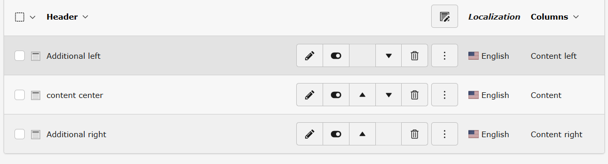
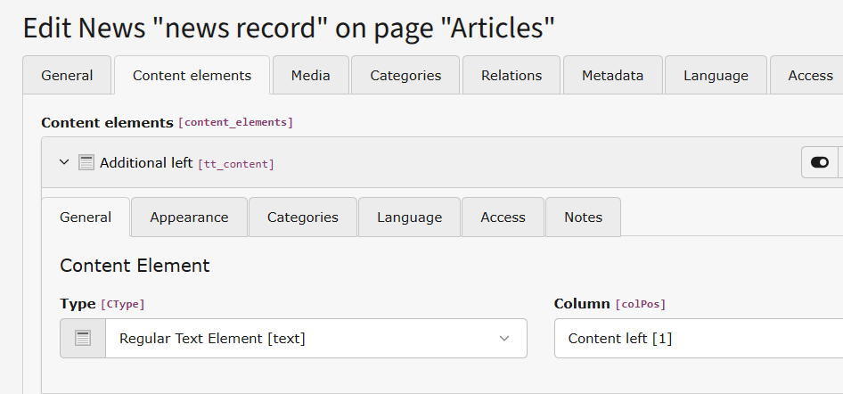
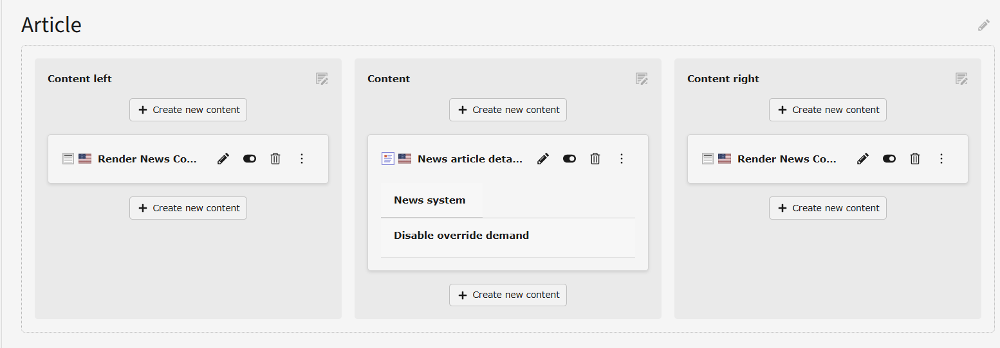
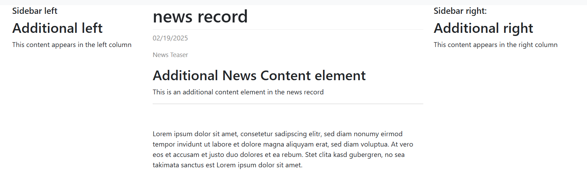

# news-content-columns
Render the additional content elements of news in your desired column.

## Installation
`composer require traw/news-content-columns` or download from [TER](https://extensions.typo3.org/extension/news_content_columns)

## Configuration

No additional config needed. The news storage folder must have the same Backend Layout as the News Detail page or at least have the same colPos columns available. 

## Usage

In the news record choose the appropriate colPos for each content element that should be rendered in another column.

The extension automatically filters the content elements that are attached to a news record.
All content elements are removed, that don't have the same colPos as the News-Detail-Plugin or the plugin that renders the detail action resp.

On the page where the News-Detail-Plugin is located or the news detail view is rendered, place the `News Content Columns` plugin in any another column to render the content elements of the current news record that have the same colPos.

## Example

Assume you have a 3-column layout.

In the news record's content elements, decide where to put the content element

Place the plugin in the columns:

The content elements will be rendered in the corresponding column

## Credits:

Extension icon shamelessly copied from https://typo3.github.io/TYPO3.Icons/icons/overlay/overlay-news.html
